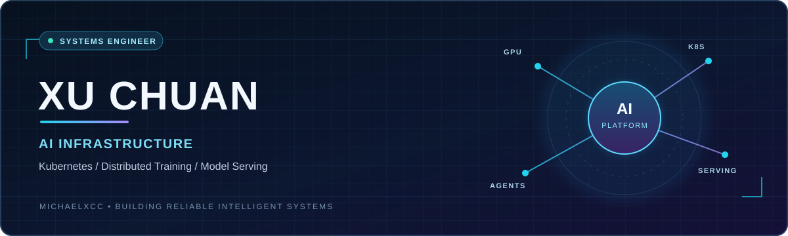
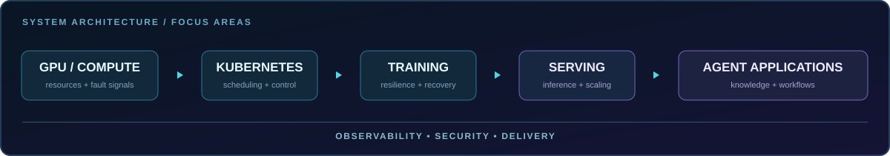

  

  <h3>让模型从训练集群走向稳定、易用的生产服务</h3>
  

    AI Infrastructure · Cloud Native · Distributed Systems 
    Go / Python · Kubernetes · LLM Training &amp; Inference
  

  

    <a href="https://github.com/MichaelXcc?tab=repositories">Explore repositories</a>
    &nbsp;·&nbsp;
    <a href="https://github.com/MichaelXcc?tab=overview">View GitHub contributions</a>
  

---

## 01 / About

我是徐川，专注于 **AI 基础设施与云原生平台工程**。从容器化模型推理、多集群资源调度，到大规模分布式训练的故障恢复，我关注的是把复杂的计算资源变成稳定、可交付的能力。

目前的工作覆盖 **Kubernetes 训推一体化平台、GPU 资源调度、可观测性和私有化智能体平台**。长期目标是让大模型的部署与使用更简单。

## 02 / Engineering focus

  

| 方向 | 我做过的工程工作 |
| --- | --- |
| **分布式训练与高可用** | 串联 GPU Xid / DCGM 故障感知、节点隔离、训练作业整组重建、TorchElastic 重组与 Checkpoint 恢复；设计本地 NVMe、跨节点副本和对象存储的分层容灾方案。 |
| **模型推理与平台化** | 基于 Docker 和 Kubernetes 建设模型推理服务，整合模型与镜像仓库、弹性伸缩、服务监控和可视化管理；推进训练、推理一体化平台落地。 |
| **调度与集群治理** | 使用 Go 开发云原生组件和调度能力，围绕 CPU / GPU 资源池化、多集群统一管理、Volcano 作业调度与大规模异构集群稳定性建设。 |
| **智能体与交付** | 建设私有化智能体平台的模型接入、知识库、工具调用、工作流和权限能力；推进软硬件一体化部署及运维标准化。 |

## 03 / Tech matrix

| Layer | Technologies & practices |
| --- | --- |
| **Languages & frameworks** | `Go` · `Python` · `Shell` · `Go kit` · `Django` · `Flask` · `React` |
| **Cloud native** | `Kubernetes` · `Docker` · `Istio` · `Kubeflow` · `Volcano` · `Helm` · Kubernetes controllers / operators |
| **AI infrastructure** | Distributed training · Model serving · GPU scheduling · `TorchElastic` · Checkpoint recovery · `DCGM` / GPU Xid |
| **Model ecosystem** | `vLLM` · `SGLang` · `PyTorch` · `Hugging Face` · `CUDA` |
| **Platform operations** | Multi-cluster management · CI/CD · `Jenkins` · `Argo CD` · `Prometheus` · `Grafana` · `EFK` · Security & access control |
| **Agent systems** | Model integration · Knowledge bases · Tool calling · Workflow orchestration · `Dify` · `RAGFlow` · `Bisheng` · `n8n` |

## 04 / Selected work

**Kubernetes 训推一体化平台**

主导分布式训练、在线推理、GPU 调度与可观测性能力建设。围绕故障检测、任务重建和分层 Checkpoint，提升训练任务的恢复能力。

**多云资源调度平台**

从零搭建跨地域 CPU / GPU 资源统一管理与调度能力，支持多集群资源池化和研发构建任务的高效运行。

**容器化模型推理服务**

将模型服务封装为独立容器，通过 Kubernetes 实现编排、弹性伸缩与故障恢复，并连接模型仓库、镜像仓库和监控系统。

**开源参与**

参与 [Volcano](https://github.com/volcano-sh/volcano) 1.10.0 相关贡献，持续关注云原生批处理与 AI 作业调度。

## 05 / Journey

| 阶段 | 重点 |
| --- | --- |
| 2019–2022 | 容器化模型推理与云平台交付 |
| 2022–2024 | 智能体数据模块、CI/CD 与可观测性 |
| 2024 | 跨地域多云资源调度 |
| 2025–至今 | AI 训推平台架构、分布式训练高可用与私有化智能体平台 |

软件工程硕士（伊利诺伊州立大学）。

---

  Build reliable infrastructure for intelligent systems. 
  <a href="https://github.com/MichaelXcc">github.com/MichaelXcc</a>

